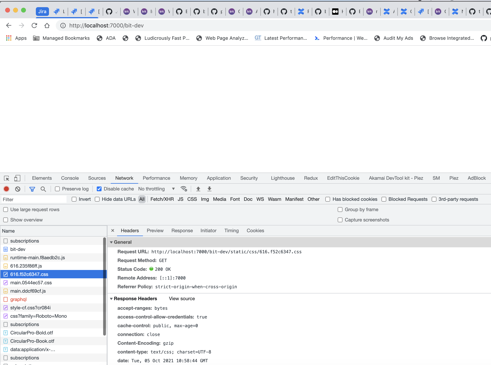

# Issue in Public path for js/css

# Overview
This repo holds the load balancer setup using webpack dev server & `bit-server` folder contains the 

## Steps to reproduce
1. Run `npm run reproduce:issue`
    1. which internally `npm run start:lb` which means starting load balancer
    2. and also starting bit server from folder `bit-server`
2. Please make sure bit-server runs at [localhost:7001](localhost:7001). You should be able to see `bit-server` scope component server up.
3. Access [localhost:7000](localhost:7001) server
4. Route to [localhost:7000/bit-dev](localhost:7000/bit-dev)

## Issue (Screenshot)
### 1

### 2
After following the steps by bit team member, I was able to hack publicPath for `static/` folder , which made us aware with new issue of `/graphql` throws `404`. Screenshot below:

## Suggested fix
1. Either static path should be relative in the html like `static/js/runtime-main.*.js` instead of `/static/js/runtime-main.*.js`
2. Or there should be in an option to set publicPath(root) ENV for `public/static` folder which serves css/js 